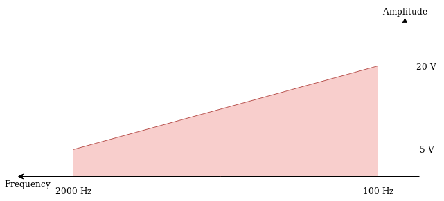

# Elektro Dosen Tugas 1
> This Project / Assignment is publicly posted and hosted on
>> https://github.com/wowotek/Elektro-Dosen-Tugas1
>
> This Project / Assignment doesn't come with any licence. Use it as you wish.
>
> This Project / Assignment doesn't come with any guarantee. Use with caution !

## *Writer* | Penulis

- Erlangga Ibrahim - @wowotek - 672017282

## *Questions* | Pertanyaan

1. What is the **relationship** between **Period** and **Frequency**?
2. What does :
   1. an **Amplitude** of a signal measure ?
   2. a **Frequency** of a signal measure ?
   3. a **Phase** of a signal measure ?
3. How can a **Composite Signal** be decomposed into it's individual frequency ?
4. A periodic composite signal with a bandwith of 2000 Hz is composed of two sine waves. The first one has a frequency of 100 Hz with a maximum amplitude of 20 V; the second one has a maximum amplitude ov 5 V. Draw the bandwith.

## *Answers* | Jawaban
### No. 1
Period and Frequency is always inverse of each other, defined with :

$$
\tag{frequency to period} \large{f} = \frac 1 {\large{T}}
$$
---
$$
\tag{period to frequency} \large{f} = \frac 1 {\large{T}}
$$
Where :
- $\large{F}$ : frequency
- $\large{T}$ : period

###  No. 2
* **Amplitude** is a measure of **intensity or values of a wave**. it's value unit defined depending on the contex. for example if we measure a voltage overtime, then the amplitude is measured in Voltage
* **Frequency** is a measure of the **amount of wave cycles within a specific timeframe**, for example 10 cycles per hour. Usually frequency is measured in amount of cycles per second with $\large{Hertz}$ or $\large{Hz}$ as it's units. for example household electricity is using an AC current measured in _usually_ $\large{50} hz$ to $\large{60} hz$ meaning the electricity Voltage going back and forth between positive and negative $50$ to$60$ times per second.
* **Phase** is a measure of **offset applied to the wave with respect of time at 0** usually measured in $degrees$ or $rad$

### No. 3
A composite signal can be analyzed with Fouriers Analysis, every single wave will be converted to a diagram which consist of frequency and the signal it self. in other words Fouriers Analysis can be used as a tool to convert time-domain diagram analysis to frequency-domain diagram analysis which later can be used to create those individual frequency and phase it $90 \large{deg}$ out of phase so it cancels out unwanted frequency.

### No. 4

